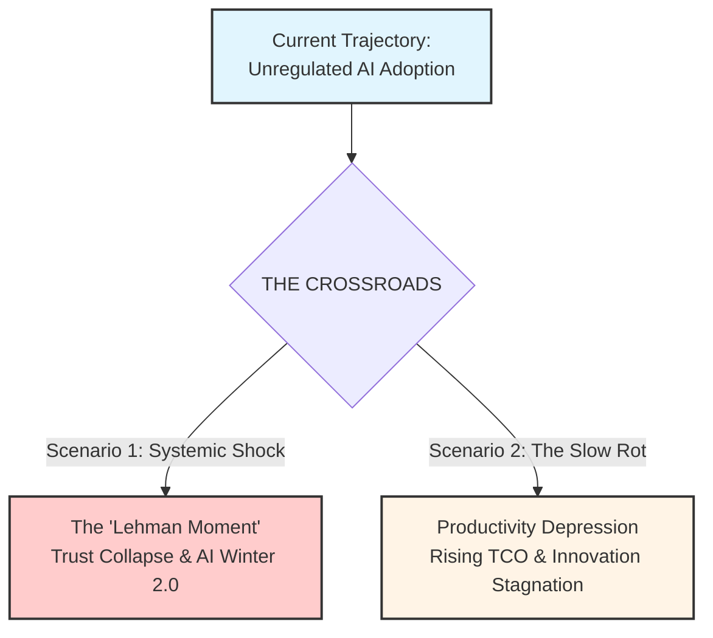

# Part 3: The Aftermath

> **Navigation:** [🏠 Home](../README.md) | [📉 Part 1: The Illusion](01_the_illusion.md) | [⚙️ Part 2: Broken Mechanics](02_broken_mechanics.md) | **Part 3** | [🛡️ Protocols](../protocols/README.md) | [📚 References](../REFERENCES.md)

**Table of Contents:**
*   [Chapter 8. The Paradox of Local Solutions](#chapter-8-conclusion-the-paradox-of-local-solutions-and-the-necessity-of-balance)
*   [Chapter 9. The Macro-Economic End Game](#chapter-9-the-macro-economic-end-game-the-trajectory-of-crisis)
*   [Chapter 10. The Architecture of Unintended Consequences](#chapter-10-the-architecture-of-unintended-consequences-who-is-actually-to-blame)

---

## Chapter 8. Conclusion: The Paradox of Local Solutions and the Necessity of Balance

We began this article with a paradox: Why does everyone feel faster, while the data shows we are slowing down?
The answer, as we have explored, is that the industry has fundamentally misunderstood the nature of AI in software engineering. We treated AI as a **Tool**—a faster keyboard—when in reality, it acts as a massive, unregulated **Workforce**.

### The Trap of the "Silver Bullet"

In Chapter 5, we explored the hypothetical solution of the **AI Code Review Agent**. To a logical engineer or a desperate manager, this seems like the obvious fix: "If AI created the flood of code, let's use AI to build a dam."

However, this highlights the central paradox of the current crisis: **A local solution often generates a new, more complex systemic problem.**

If you deploy an AI Agent to review code, you haven't removed the burden from your Senior Engineers; you have simply **shifted the point of tension**.
*   **Before:** The Senior Engineer was drowning in low-quality Pull Requests.
*   **After:** The Senior Engineer is now responsible for **maintaining the Agent**. They must audit its decisions, update its context (RAG), debug its hallucinations, and ensure it isn't rejecting valid code or approving subtle security flaws.

The bottleneck didn't disappear; it mutated. The Senior Engineer stops being a "Reviewer of Code" and becomes a "Maintainer of Infrastructure." The cognitive load remains critically high, but now it is hidden behind the illusion of automation.

### The Challenge of Systemic Rebalancing

This example proves that there is no "correct" solution for a single node of the SDLC in isolation. The crisis we face is not a problem of individual efficiency; it is a problem of **systemic synchronization**.

The Software Development Life Cycle is a tightly coupled ecosystem. Every intervention creates a ripple effect:
*   If you use AI to accelerate **Requirements Gathering**, you risk flooding the backlog with unverified ideas that the team cannot digest.
*   If you use AI to accelerate **Coding**, you crush the Review process.
*   If you use AI to accelerate **Review**, you shift the bottleneck to QA and Maintenance, potentially automating the deployment of bugs.

The true challenge for Engineering Leadership is not to find the "right tool" to plug a specific hole. It is the immensely difficult task of **rebalancing the entire assembly line** to accommodate this new reality.

### Final Verdict

There is no playbook for this. There is no vendor who can sell you a "Balanced SDLC."
What works for a startup (accepting high risk for high speed) will destroy an enterprise (where stability is paramount).

AI is the most powerful force multiplier in the history of software engineering. But a multiplier works both ways.
*   If applied to a chaotic, unbalanced process, it multiplies **Chaos**.
*   If applied to a disciplined, synchronized system, it multiplies **Value**.

The choice is yours. You can continue to chase local optimizations—buying tools to make specific tasks faster—and watch your overall engineering velocity grind to a halt under the weight of complexity.
Or you can accept the hard truth: **There is no free lunch.**
The entire system must be redesigned as a whole, accepting that every gain in speed in one area requires a deliberate investment in stability in another.

---
## Chapter 9. The Macro-Economic End Game: The Trajectory of Crisis

The systemic setup we have analyzed—the collision of market pressure, the "Execution Mandate," and a broken SDLC—is not merely a collection of local management errors. It is a **self-reinforcing degradation mechanism** that is currently driving the entire industry toward a precipice.

We are not asserting that a collapse is inevitable. However, we must recognize the vector of our current movement: **The longer we operate under the "Safe Strategy" of unregulated AI adoption, the higher the probability of a systemic correction.**

Every day that an enterprise prioritizes "Typing Speed" over "Systemic Balance," it adds compound interest to a debt that will eventually come due. If this trajectory remains unchecked, we foresee two potential end games for the industry.

### Scenario 1: The "Lehman Moment" of AI (Systemic Shock)
*Low Probability, High Impact*

In this scenario, the accumulation of "Subprime Code" reaches a critical mass, leading to a sudden, visible collapse of trust.
*   **The Mechanism:** Just as subprime mortgages were bundled into "safe" assets, toxic AI-generated code is currently being bundled into critical infrastructure (Banking, Logistics, Healthcare).
*   **The Trigger:** A series of catastrophic failures in non-tech enterprises—perhaps a massive security breach caused by hallucinated vulnerabilities, or a total paralysis of a core banking system due to unmaintainable complexity.
*   **The Consequence:** The market realizes that the "assets" (codebases) are toxic. Investor trust evaporates. Boards issue panic-driven bans on AI tools. We enter **AI Winter 2.0**, not because the technology failed, but because our *management* of it failed.

### Scenario 2: The Slow Rot (Productivity Depression)
*High Probability, High Friction*

This is the more likely outcome. There is no explosion, only a gradual suffocation of innovation.
*   **The Mechanism:** The degradation of the SDLC slowly eats away at the engineering capacity of thousands of companies.
*   **The Process:** Maintenance budgets balloon as teams spend 80-90% of their time fixing the "plausible lies" generated in previous years. Feature delivery grinds to a halt.
*   **The Consequence:** The industry suffers a **"Productivity Depression."** We end up spending *more* money to build *less* software than we did in 2020. Small and medium businesses, unable to afford the massive refactoring required to clean their codebases, quietly go bankrupt or are acquired for parts.

### The Verdict on the "Safe Strategy"

In both scenarios, the irony is tragic. The strategy that Boards currently view as "Safe" (buying licenses without investing in deep operational transformation) turns out to be the **most dangerous position possible**.

By refusing to pay the upfront cost of rebalancing the SDLC today, leadership is inadvertently betting the company's future on the hope that the bubble won't burst. But as the metrics show, the bubble is already inflating.

***

## Chapter 10. The Architecture of Unintended Consequences: Who Is Actually to Blame?

We live and work in an ecosystem of extreme complexity, bordering on chaos. In such systems, the human brain craves simple answers. We want a villain. We want a name, a company logo, or a job title to point at and say: *"This is your fault."*

But if we are intellectually honest, we must admit a difficult truth: **There is no villain in this story.**

---

### The Tragedy of Rational Actors

If we analyze the motivations of every player in this crisis, we find that they are acting completely rationally within their own paradigms.

*   **The Vendors:** They have engineered a technological marvel. Their imperative is to monetize it to fund the massive R&D costs for the next generation. They want to capture market share quickly. Are they "evil" for selling their product aggressively? **No.**
*   **The Investors:** They are deploying capital into the highest-growth sector of the economy. They listen to the vendors' projections and demand exposure to AI. They want returns. Are they "guilty" for demanding growth? **No.**
*   **The C-Suite:** They are under immense pressure from investors to "not be the next Nokia." They have limited visibility into the granular reality of the codebase. They hear the hype, they fear obsolescence, and they choose the "safest" path: buy the licenses and push for adoption. Are they "incompetent"? **No.**

---

### The Design of Disaster

The profound tragedy of the "Subprime Code Crisis" is that it lacks a **Point of Architecture**.

No one sat down and planned to flood the industry with unmaintainable code. No one architected a collapse.
The crisis is emerging because every actor is optimizing for their **Local Best Interest**, but the vector sum of these rational efforts is driving the **Global System** toward a cliff.

This is the most dangerous type of catastrophe. When everyone is "doing the right thing" from their perspective, there is no obvious error to correct. There is only the silent accumulation of systemic risk. We are collectively sleepwalking into a disaster, driven by the best of intentions.

---

### A Plea to the "Stewards of Capital" (Investors & C-Level)

To the Boards and Executives: We do not ask you to stop innovation. We ask you to stop listening to the echo chamber of hype and remember the fundamentals of your business.

**Your Codebase Is Your Asset.**
It is not a cost center to be minimized; it is the machinery that generates your revenue.
Generating profit today through "AI Speed" is good. But exploding your **Total Cost of Ownership (TCO)** in a way that kills your agility tomorrow is a violation of your fiduciary duty.

**The Pivot:**
1.  **Stop the "License Strategy":** Buying AI Code Assistants is not a strategy. It is a procurement decision.
2.  **Demand a Real AI Strategy:** Calculate the systemic ROI. If you increase coding speed by 50%, what is the cost of the increased Review, QA, and Maintenance?
3.  **Change the Metrics:** Stop measuring "Adoption Rate." Start measuring **Asset Health**:
    *   *Technical Debt Ratio*
    *   *Defect Escape Rate*
    *   *Maintenance Effort vs. New Feature Delivery*
4.  **Resource the Transformation:** Acknowledge that AI is a disruptor. You need to fund the re-architecting of your teams and pipelines to handle the "firehose" of code.

---

### A Plea to the Vendors

To Microsoft, OpenAI, Google, Anthropic, and others:
We have immense respect for the technology you have built. It is a breakthrough.

But profit today cannot be your only metric.
If this technology "kills the host"—if it floods your clients' ecosystems with unmanageable debt until they collapse or reject the tool—you lose too.

**The "Parasitic Model" Risk:**
In biology, a relationship that exhausts the host eventually leads to the demise of the guest. If the market strategy for AI tools remains purely **extractive**—prioritizing short-term revenue from code volume over the long-term survival of the client's codebase—it becomes a **parasitic model**.

And as every biologist knows: a parasite that kills its host does not survive for long. If the industry loses faith in AI because it caused a "Subprime Crash," or if your enterprise clients become paralyzed by the complexity your tools generated, your revenue streams will evaporate.

**The Pivot:**
1.  **Restrain the PR:** Stop selling "magic." Start selling "power tools that require safety protocols."
2.  **Focus on Sustainability:** Your goal should shift from "User Adoption" to **"Client Sustainability."** Help us build the governance layers, the testing frameworks, and the educational programs needed to manage this power.
3.  **Balance the Narrative:** Be realistic. Acknowledge the risks. Be a partner in engineering integrity, not just a supplier of raw speed.

We are all in this ecosystem together. If it crashes, it crashes for everyone.

---
**Next:** [🛡️ Activate Defense Protocols](../protocols/README.md)